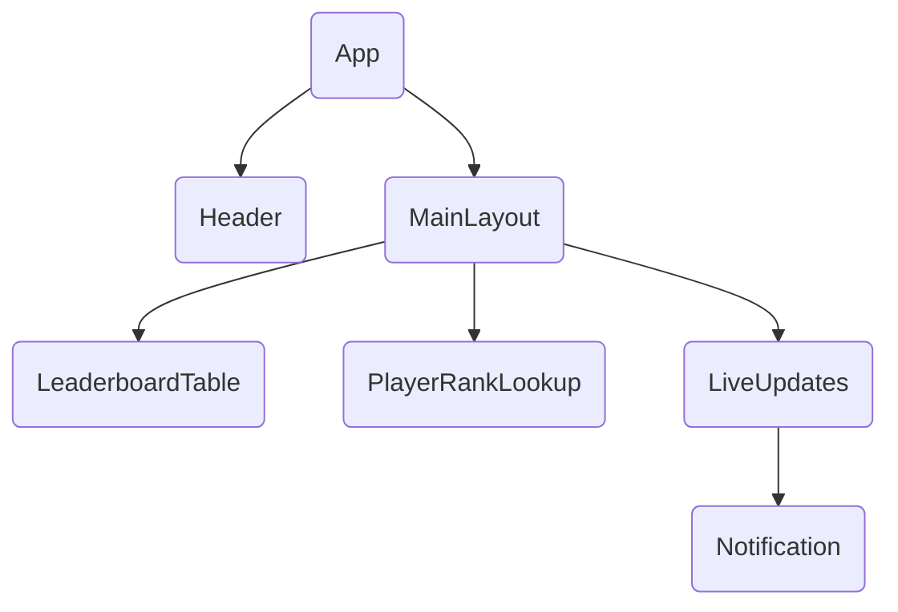

# Gaming Leaderboard – Component Architecture

## Component Responsibilities

1. **App**: Root component; sets up global providers and renders `Header` + `MainLayout`.
2. **Header**: Displays application title, theme toggle, etc.
3. **MainLayout**: Handles page layout (flex/grid). Hosts core feature panels.
   - **LeaderboardTable**: Shows top-10 leaderboard rows.
   - **PlayerRankLookup**: Search form to fetch individual player rank.
   - **LiveUpdates**: Establishes WebSocket connection and distributes real-time events.
     - **Notification**: Toast/banner notifying users of leaderboard or rank changes.

## State Management Strategy

• **React Context + Custom Hooks** – lightweight for current scope.
  - `LeaderboardContext` – stores leaderboard list, loading/error flags, `refresh()`.
  - `PlayerContext` – stores looked-up player data.
  - `SocketContext` – exposes connection status and event emitters.

• **Data Flow**
  1. Components read data via hooks (`useLeaderboard`, `usePlayerRank`).
  2. `LiveUpdates` listens to socket events and dispatches context updates, triggering UI re-render.

• **Why not Redux/Zustand?**  The data surface is small (≤3 slices) and unidirectional; React Context keeps bundle size minimal.

## Next Steps

1. Scaffold the components listed above (empty functional components).
2. Implement `LeaderboardContext` & hooks.
3. Integrate socket layer when we reach Phase 3.

---
*Authored automatically as part of Step 2 execution.* 